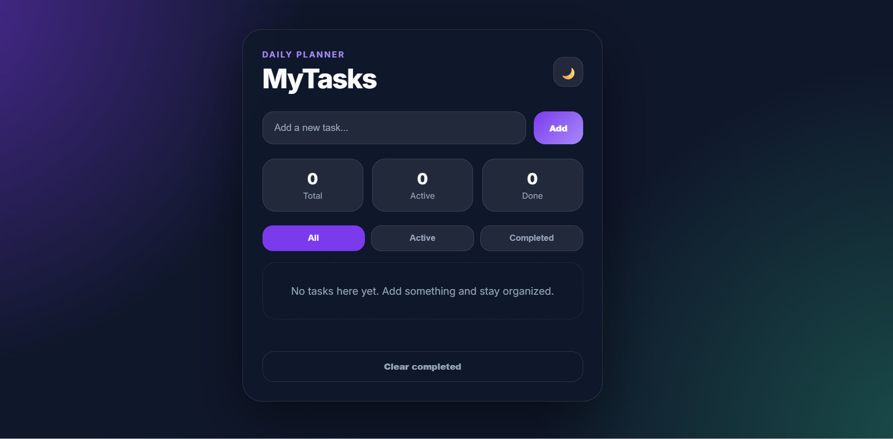

# MyTasks - Modern To-Do App

A clean and modern To-Do application built with HTML, CSS, and JavaScript.

## Features

- Add and delete tasks
- Mark tasks as completed
- Filter tasks (All / Active / Completed)
- Local storage support
- Dark and light mode
- Responsive modern UI
- Smooth animations

## Technologies Used

- HTML5
- CSS3
- JavaScript (Vanilla JS)

## Design

The application features a modern glassmorphism-inspired interface with responsive layouts and smooth user interactions.

The UI color palette was inspired by modern AI-assisted design concepts.

## Preview

## Author

Created by Aristotel Lala
